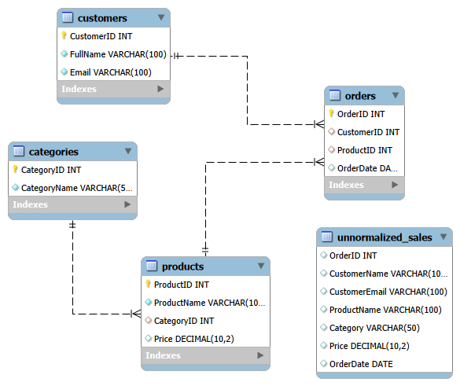

# Relational Databases & Advanced SQL 🗄️

A comprehensive repository dedicated to production-grade database schema design, normalization strategies, and optimization of complex analytical queries. This project documents my execution of data integrity principles, relational mapping, and structured database engineering.


---

## 🚀 Core Competencies Covered

### 1. Database Schema Design & Modeling
* **Conceptual & Logical Modeling:** Designing data models from raw business requirements.
* **Entity-Relationship Diagrams (ERDs):** Defining clear entities, attributes, primary keys, and complex foreign key relationships.
* **Relational Mapping:** Translating abstract diagrams into executable, high-performance DDL scripts.

### 2. Strict Normalization Pipeline (Up to 3NF/BCNF)
Ensuring zero data redundancy and maximizing data integrity by driving schemas through formal normalization states:
* **1NF:** Eliminating duplicate columns and ensuring atomicity of data fields.
* **2NF:** Removing partial dependencies to ensure all non-key attributes depend entirely on the primary key.
* **3NF / BCNF:** Eliminating transitive dependencies to prevent data anomalies during `INSERT`, `UPDATE`, and `DELETE` transactions.

### 3. Advanced Analytical SQL Execution
Writing and profiling optimized scripts for relational engines:
* Complex multi-table inner/outer joins.
* Nested subqueries and Common Table Expressions (CTEs) for readable, modular logic.
* Aggregations, data grouping, and advanced constraint handling (`UNIQUE`, `CHECK`, `FOREIGN KEY` cascades).

---

## 📁 Repository Structure

```text
├── ERD-Diagrams/          # Visual schema layouts and relational mappings
├── Normalization/         # Documentation and case studies breaking anomalies down to 3NF
├── SQL-Scripts/
│   ├── DDL-Schemas/       # Database generation tables, constraints, and indexes
│   └── DML-Queries/       # Complex analytical queries, reports, and joins
└── README.md

---

---

## 📊 Entity-Relationship Diagram (ERD)

Below is the relational schema design mapping out the database entities, primary keys, and constraint dependencies:



